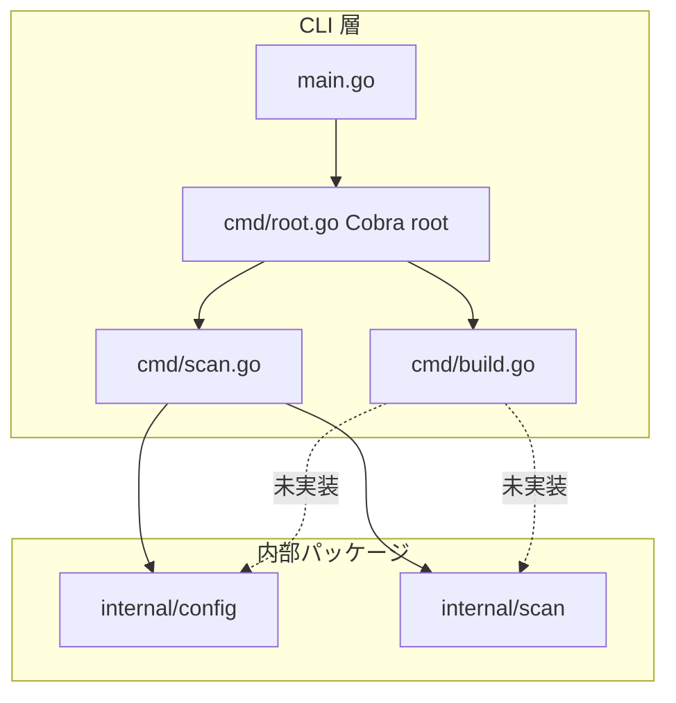
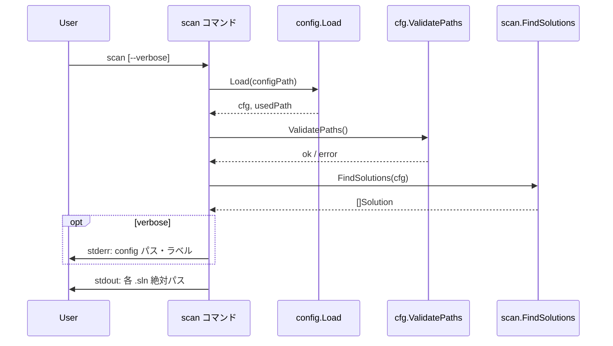
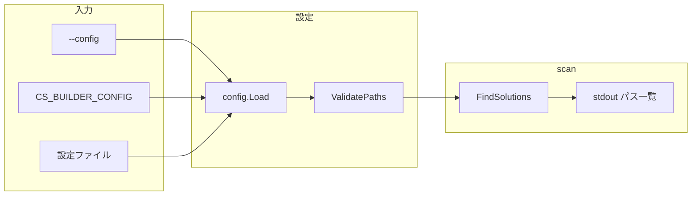

# アプリケーション処理フロー仕様

cs-builder の**起動から各サブコマンド完了まで**の処理順序とデータの流れを、現行実装と将来予定を区別して記載する。設定キーの意味は [**config-spec.md**](config-spec.md)、プロダクト要件の背景は [**requirements.md**](requirements.md) を参照。

---

## 1. 用語

| 用語 | 意味 |
|------|------|
| **cwd** | プロセスのカレントワーキングディレクトリ。`project_root` の相対解決に使う。 |
| **設定ファイル** | 既定名 `cs-builder.yaml`。読み込み順は §3。 |
| **scan root** | `scan_roots` の 1 要素を `project_root` から辿ったディレクトリ。探索の論理上の根。 |

---

## 2. 全体構成（コンポーネント）

ルートからの **TUI 起動・画面遷移・シーケンス**は現状コードに無く、要件ベースの設計は [**tui-flow.md**](tui-flow.md) を参照。

- **エントリ**: `main.go` が `cmd.Execute()` を呼び、Cobra がルートコマンド `cs-builder` とサブコマンドを解釈する。
- **永続フラグ**: ルートに `--config` があり、全サブコマンドで `configPath` として共有される。

---

## 3. 設定ファイルパスの決定（全コマンド共通）

`internal/config.Load(explicitPath)` の前段 `resolveConfigPath` による。**上ほど優先**。

1. `explicitPath`（`--config` に非空が渡されたとき）→ `filepath.Clean` のみ。ファイルの存在確認は `ReadFile` 時。
2. 環境変数 `CS_BUILDER_CONFIG` が非空 → 同様に `Clean`。
3. それ以外 → `filepath.Join(cwd, "cs-builder.yaml")`。

読み込み後は **YAML パース → `ApplyDefaults` → `Validate`**（必須キー・版・数値下限など）。ディスク上の `project_root` / `scan_roots` の実在確認は **`ValidatePaths`** を、探索系コマンドが明示的に呼ぶ（`Validate` 単体ではパス実在は見ない）。

---

## 4. サブコマンド別フロー

### 4.1 `cs-builder`（ルートのみ）

現状、サブコマンドなしで実行しても**独自の Run はなく**、Cobra のヘルプ表示に終わる（`Use: cs-builder`）。

### 4.2 `cs-builder scan`（実装済み）

**目的**: 設定に基づき `.sln` を探索し、**各ファイルの絶対パスを標準出力に 1 行ずつ**出力する。

| 手順 | 処理 | 失敗時 |
|------|------|--------|
| 1 | `config.Load(configPath)` で設定取得 | パス解決・読込・YAML・`Validate` エラーを返す |
| 2 | `cfg.ValidatePaths()` で `project_root` と各 `scan_roots` が存在しディレクトリであることを確認 | いずれか欠落・非ディレクトリでエラー |
| 3 | `scan.FindSolutions(cfg)` で `.sln` 一覧を構築 | I/O エラー等でエラー |
| 4 | `--verbose` 時: stderr に使用した設定パス、各ソリューションについて `ScanRoot` / `PackageDir` / `Tenant` を併記 | — |
| 5 | stdout に `Solution.Path` を辞書順（パス文字列順）で 1 行ずつ出力 | — |

**`scan` 専用フラグ**: `--verbose`（設定パスとメタ情報を stderr へ）。

### 4.3 `cs-builder build`（未実装）

現状 `Run` は固定メッセージ **`build: not implemented`** を標準出力に出して終了する（終了コード 0）。

**要件上の想定フロー**（将来実装時の参考・[requirements.md](requirements.md) より）:

1. 設定読込・パス検証（必要なら `scan` と同様）。
2. 対象 `.sln` の決定（スキャン結果に対する CLI フラグ / TUI 選択など。詳細は未確定）。
3. `dotnet build`（および restore 方針等）実行。
4. `log` 設定に応じた slog・ファイル出力、`artifacts` に応じた生成物コピー。

---

## 5. スキャンアルゴリズム（`scan.FindSolutions`）

`project_root` を絶対パス化し、各 `scan_roots` エントリについて **そのディレクトリを根とした部分木**を走査する。

**除外**: ディレクトリ名（パス 1 セグメント）が `scan_exclude_dir_names` に一致（trim 後・大小無視）する子は**降りない**。省略時は `bin`, `obj`, `.git`, `node_modules`。YAML で `[]` と明示した場合は除外なし。

**`.sln` の見つけ方**（各ディレクトリで）:

1. 当該ディレクトリの**直下のファイル**のうち、拡張子が `.sln`（大小無視）のものをすべて収集し、ファイル名順でソート。
2. **1 つでもあれば**、それらをすべて結果に加え、**そのディレクトリ以下には再帰しない**（子フォルダに別 `.sln` がある前提で枝刈り）。
3. **1 つもなければ**、除外に該当しない各子ディレクトリへ再帰。

**重複除去**: 同じ `.sln` 絶対パス（`filepath.Clean` キー）は複数 scan root で拾っても **1 回だけ**。

**`PackageDir` / `Tenant`**: `.sln` の親ディレクトリについて、scan root からの相対パスを `/` 区切りで分割し、第 1 セグメントを `PackageDir`、第 2 以降を `/` 結合を `Tenant`（1 セグメントのみなら `Tenant` は空）。`.sln` が scan root 直下にある場合は両方空。

> **要件との関係**: [requirements.md](requirements.md) §2.3 は「第 1 階層をパッケージ」とする**ディレクトリ構造側の説明**である。実装は **再帰＋「.sln がある階層で停止」**であり、テナント配下より深いツリーでも、中間に `.sln` のないフォルダが続く限り探索が続く。挙動の詳細は本節を正とする。

---

## 6. データフロー概要図

---

## 7. 終了コード

| 状況 | 終了コード |
|------|------------|
| コマンド成功 | 0 |
| `cmd.Execute()` がエラーを返したとき（設定・検証・I/O 等） | `main` が `os.Exit(1)` |

---

## 8. 改訂履歴（メモ）

- 初版: `scan` 実装および `build` スケルトン時点のフローに同期。
