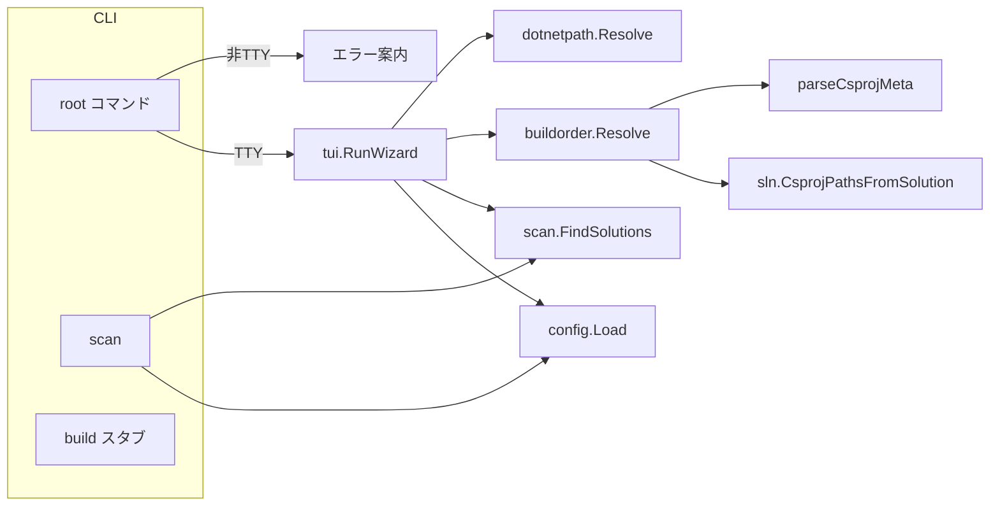

# アーキテクチャ（実装概要）

## 全体像

## ルートコマンド（引数なし）

1. `golang.org/x/term.IsTerminal(os.Stdin)` で対話可否を判定。
2. 対話可能なら `tui.RunWizard(configPath)`。`configPath` は `--config`（空なら `config.Load` 内で環境変数・cwd のファイルを使用）。
3. `WizardResult.BuildFailures` が 1 件でもあればプロセスを非ゼロ終了。

## `scan` サブコマンド

1. `config.Load` → `cfg.ValidatePaths`。
2. `scan.FindSolutions(cfg)`。
3. 各 `Solution.Path` を stdout に 1 行ずつ。`--verbose` 時は使用した設定パスと `ScanRoot` / `PackageDir` / `Tenant` を stderr に出力。

## 対話ウィザード（`internal/tui`）

フェーズ順: **構成（Debug/Release）→ テナント → `.sln` 選択（スペースで複数チェック）→ 確認 → ビルド実行 → サマリ**。

- テナントは `scan.Solution.Tenant` との **文字列一致** でフィルタ。`all` は全件。
- 確認で Enter を押すと `buildorder.Resolve(cfg, targetPaths)` で `.csproj` の順序を計算し、`tea.ExecProcess` で順番に `dotnet build <csproj> -c <構成>` を実行。

## `.sln` 探索（`internal/scan`）

- 各 `scan_roots` を根に DFS。
- ディレクトリ名が `scan_exclude_dir_names` に一致（セグメント一致・大小無視）したら降りない。
- あるディレクトリの **直下** に `.sln` があればそれらを収集し、そのディレクトリ以下には **再帰しない**。
- `PackageDir`: `scan_root` から `.sln` の親までの相対パスの **先頭セグメント**。
- `Tenant`: 2 セグメント目以降を `/` 結合。1 セグメントのみなら空。

## ビルド順序（`internal/buildorder`）

1. 選択された各 `.sln` について `sln.CsprojPathsFromSolution` でエントリ `.csproj`（シード）を取得。
2. シードから BFS で各 `.csproj` を展開。辺は「前提 → 依存側」:  
   - `ProjectReference` の先は前提。  
   - `HintPath` の `.dll` はファイル名（拡張子除く）を AssemblyName とみなし、`assemblyCsprojIndex` で `scan_roots` 配下の `.csproj` に解決できた場合のみ辺を追加（範囲外は無視）。
3. 全ノードで Kahn 法によるトポロジカルソート。閉路があればエラー。
4. シードから **推移的に必要なノードだけ** を最終列に残す（トポ順は維持）。

`assemblyCsprojIndex` は `scan_roots` 配下を `WalkDir` し、各 `.csproj` の `<AssemblyName>`（なければファイル名）でマップ。**同一 AssemblyName の重複はエラー**。

`.csproj` の解析は正規表現ベース（`ProjectReference` / `AssemblyName` / `HintPath`）。MSBuild の条件付きやインポートの完全再現ではない。

## `dotnet` の解決（`internal/dotnetpath`）

優先順: `CS_BUILDER_DOTNET`（ファイルまたはディレクトリ）→ `exec.LookPath("dotnet")` → `DOTNET_ROOT` → Windows の Program Files 配下。

## 主要な外部依存

- [Cobra](https://github.com/spf13/cobra): CLI
- [Bubble Tea](https://github.com/charmbracelet/bubbletea): TUI
- [yaml.v3](https://gopkg.in/yaml.v3): 設定パース
