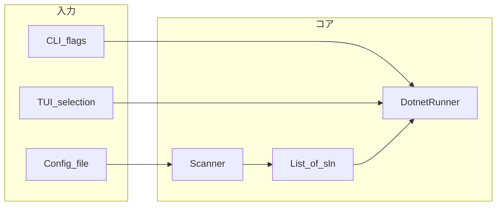

# cs-builder 要件（ドラフト）

Go（Cobra + Bubble Tea）で C# ソリューション向けの CLI / TUI ビルドツールを想定した要件メモ。**確定事項は第2節**、残りの検討は**第6節**に集約する。

---

## 1. 目的・スコープ

- **目的**: モノレポ風の C# レイアウトから `.sln` を見つけ、選択的または一括で `dotnet` ビルドを実行する。
- **形態**: **CLI（Cobra）** と **TUI（Bubble Tea）** の両方を提供する。入口の扱いは**第2節**。
- **対象レイアウト（想定例）**:
  - `2_if/` と `3_driver/` 直下に「パッケージ」ディレクトリが並ぶ。
  - **パターン A**: パッケージ直下に `.sln` がある（例: `logger/Logger.sln`）。
  - **パターン B**: パッケージ直下にテナント等の子フォルダがあり、その中に `.sln`（例: `sql/tenant1/Sql.Tenant1.sln`）。
- **`1_core/` 等**: 単層レイアウトもあり得る。**スキャンに含めるパスは設定ファイルで列挙**する（第2節）。リポジトリごとに `1_core` を足すかどうかは設定で決める。

---

## 2. 確定事項

### 2.1 スキャン起点・パス

- **プロジェクトルートやスキャン対象ディレクトリは設定ファイルに記載**する。実行ファイル（バイナリ）のインストール場所をスキャン起点には**しない**（`go install` 等とリポジトリ位置が一致しないため）。
- 設定の**形式は YAML**、キー・ファイル名・探索順は [**設定ファイル仕様（config-spec.md）**](config-spec.md) に記載する。

### 2.2 CLI / TUI の入口

- **オプションなしで起動し、かつ TTY がある場合**: 既定は **TUI** とする。TUI 上で不足している指定を埋める。**必要な条件がすべて満たされていれば**、ウィザードを省略または最小化し、**そのままビルドを開始**してよい。
- **非TTY**（CI、パイプ、リダイレクト等）: **TUI は使わない**。CLI のフラグ（および設定ファイルの内容）だけで完走できる経路を用意し、対話不能である旨をメッセージで示す。
- **主な想定利用**: Windows の PowerShell、Linux の bash 等、または GUI から実行ファイルを起動して**ターミナル画面から操作**すること。

### 2.3 探索ルール（ディレクトリ構造側）

- 設定で指定した各スキャンルートの **第1階層子ディレクトリ** をパッケージとみなす（例: `2_if/logger`）。
- パッケージ直下に `*.sln` があればそのフォルダをターゲット候補とする。なければ **直下の各子ディレクトリ** 内の `*.sln` をテナントパターンとして拾う。
- 同一フォルダに複数 `.sln` がある場合や、それより深いネストの扱いは**第6節**。

### 2.4 ログ

- **ツールログ**: Go の **`log/slog`** で構造化ログとする。**ファイルへの書き出しは設定で ON/OFF** できる。OFF のときは **stderr** のみ（など、コンソール側の出力方針は実装時に決める）。人間向けテキストと、将来 **JSON Lines**（`JSONHandler`）への切替は実装時に決める。
- **1 回のビルドフロー（起動から当該フロー完了まで）あたりログファイルは 1 つ**とする。ファイル出力が ON のとき、その 1 ファイルに **slog の行と `dotnet build` 等の標準出力・標準エラーを時系列で記録**する（ソリューションが複数あっても分割しない。見出し・プレフィックスで区別しやすくするのは実装任せ）。
- **ローテーション / 削除**: ログ保存先ディレクトリ内の**古いファイルを削除**する。**保持期間の既定は 7 日**（最終更新またはファイル名の日付基準など、削除判定は実装時に決定）。起動時またはフロー終了時のいずれかで掃引する想定。保持日数を設定で変えられるようにしてもよい。
- **SQLite 等への永続化**は採用しない（履歴クエリが要件化した段階で再検討）。

### 2.5 生成物のコピー

- **`dotnet build` の結果として得られる生成物を、リポジトリ内（または指定パス）の別ディレクトリへコピー**できる必要がある。
- **コピーの有無とコピー先のルート**は **YAML 設定**で指定する（[**config-spec.md**](config-spec.md) の `artifacts`）。どのファイルを対象にするか・`destination` 配下のサブフォルダ規則は実装で定義し、必要なら後から設定キーを増やす。

---

## 3. 機能要件（案）

| 領域 | 内容 |
|------|------|
| **探索** | 設定ファイルに基づき `.sln` 一覧を生成する。 |
| **表示** | 一覧を人間が読める形で出す（パス、パッケージ名、テナント有無など）。 |
| **選択** | TUI で複数選択、または CLI フラグでフィルタ（パッケージ名・テナント・glob 等）。 |
| **実行** | 選んだ各 `.sln` に対して `dotnet build`（必要なら `restore` を明示）。失敗時の終了コードは**第6節**。ビルド出力のファイル化は**第2節 2.4**。生成物のコピー先は**第2節 2.5**・[**config-spec.md**](config-spec.md)。 |
| **ログ** | **slog**。ファイル出力は**設定で切替**、ON 時は**フローごとに 1 ファイル**（**第2節 2.4**）。 |
| **設定** | YAML。詳細は [**config-spec.md**](config-spec.md)。 |

---

## 4. 探索ルール（補足・深さ）

- **第2節**に基本ルールを記載済み。
- **それより深いネスト**を探索対象に含めるかは**第6節**で決定する。

---

## 5. 非機能要件（検討リスト）

- **並列度**: ソリューション単位で並列 `dotnet build` するか、逐次か（マシン負荷・ログの見やすさ）。
- **環境**: `dotnet` は PATH 前提か、SDK バージョン固定（`global.json`）との関係。
- **CI / 非TTY**: **第2節**のとおり TUI は使わない。ツールログは **slog**（**第2節 2.4**）。ファイル出力 OFF なら stderr のみ、ON ならフロー単位ファイル＋必要に応じてパスを stderr に出す、など CI でも再現しやすい動きにする。
- **テスト**: `testdata/` でディレクトリパターンとスキャナの単体テスト。

---

## 6. 未確定事項

1. **1 フォルダ複数 `.sln`**: すべてターゲットか、名前規則で 1 つに絞るか。
2. **ネスト深度**: テナント直下より深い階層に `.sln` がある場合に拾うか。
3. **ビルドコマンド**: `dotnet build` のみか、`--configuration Release`、`--no-restore` のデフォルト、追加で `test` など。
4. **失敗時**: 1 つでも失敗で非ゼロ終了か、続行して最後にまとめるか。
5. **設定以外の未確定**: 下記 1〜4。設定のファイル名・キー・パス解釈は [**config-spec.md**](config-spec.md)（YAML v1）に集約済み。

---

## 7. リポジトリ現状

- `main.go` / `cmd/root.go` / `cmd/build.go` はスケルトン。
- [`directory.md`](directory.md) は別プロジェクトのテンプレであり、本リポジトリの最終構成を表さない。実装・要件に合わせて README または本ディレクトリのドキュメントを更新する。

---

## 8. 次のステップ（要件確定後）

**第6節**を埋める → コマンド設計（サブコマンド名・フラグ）。[設定は config-spec.md](config-spec.md) を実装に合わせて更新 → 最小構成から実装。

### 処理のざっくり流れ（参考）

