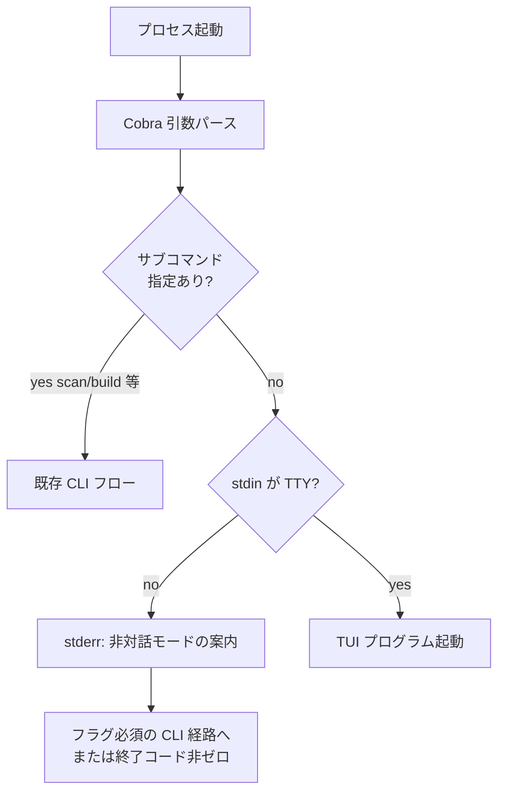
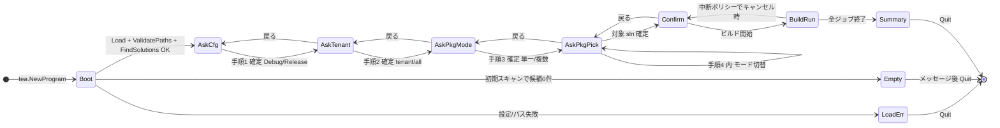
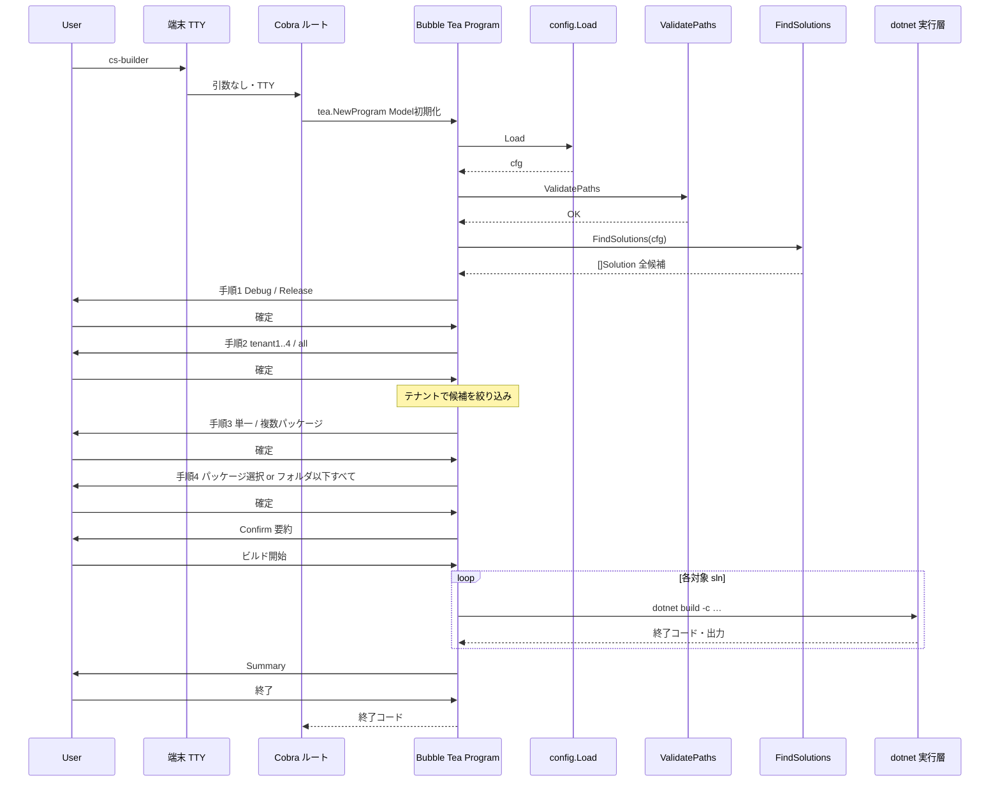
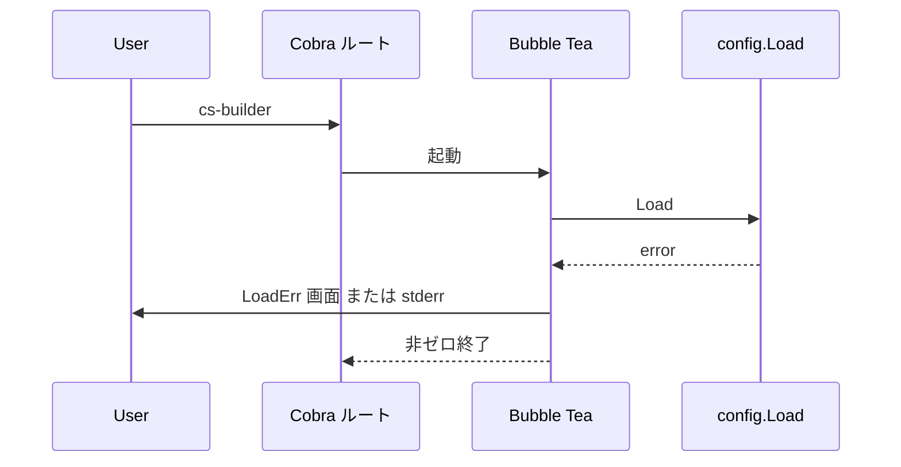
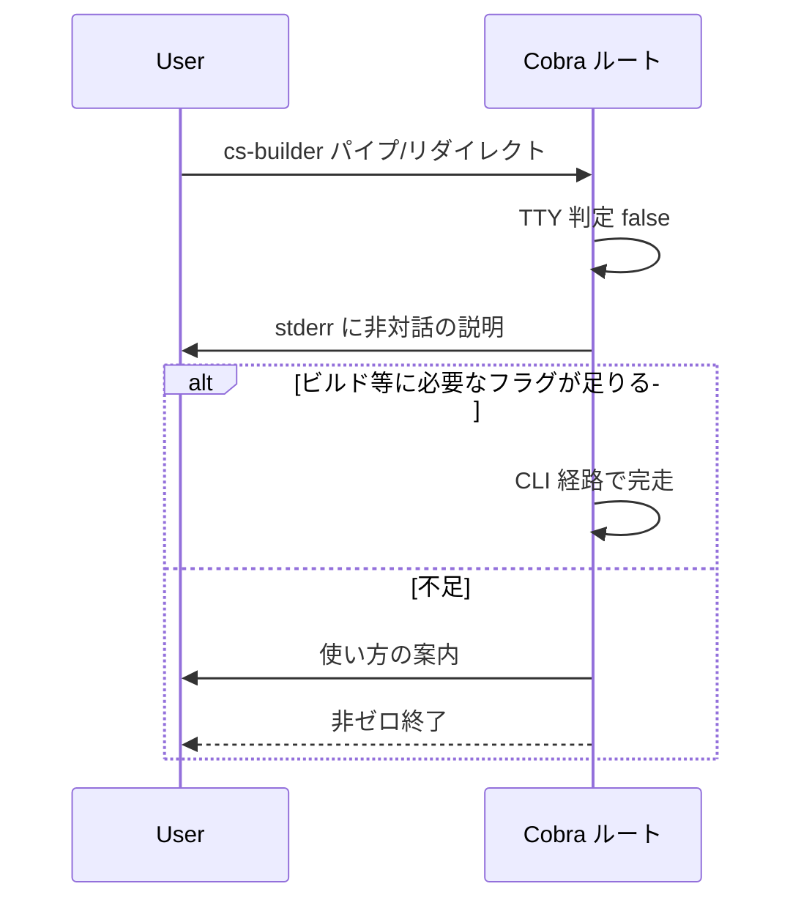

# TUI 遷移フロー・シーケンス仕様（設計案）

Bubble Tea による **TUI の画面遷移とメッセージの流れ**を整理する。**現リポジトリには未実装**（コードに Bubble Tea 依存なし）。前提は [requirements.md](requirements.md) §2.2・§3 の表、および [application-flow.md](application-flow.md) の設定・スキャン処理。

---

## 1. スコープと前提

| 項目 | 内容 |
|------|------|
| 対象 | 対話的に **対象 `.sln` を選び `dotnet build` に至る**経路（ビルド・ログ・成果物コピーは将来 `internal/` と共有）。 |
| 入口 | **サブコマンドなし**で `cs-builder` を起動し、**標準入力が TTY** であるとき、既定で TUI を起動する（要件 §2.2）。 |
| 非TTY | TUI は起動せず、**CLI フラグ＋設定のみ**で完走する経路とし、対話不能である旨を **stderr 等に明示**（要件 §2.2）。 |
| 設定 | `config.Load` / `Validate` / `ValidatePaths` の意味は [application-flow.md](application-flow.md) §3 に同じ。TUI でも **設定ファイルは必須**とし、欠落時は TUI に入る前に終了してよい（実装判断）。 |

**Cobra との関係（実装時の想定）**: ルートコマンドの `Run` で「引数なし・TTY」のとき `tea.NewProgram` を起動する、または薄いラッパサブコマンドに寄せる、などは実装で決める。本書は **論理状態とシーケンス**を定義する。

---

## 2. 起動時の分岐（ルート）

- **`scan` / `build` 等が付く場合**: 現状どおり **CLI のみ**（TUI と競合しない）。
- **非TTY**: 例として `cs-builder build --all` のように **フラグで対象と動作が決まる**経路を用意する（詳細は build 設計時に確定）。

---

## 2.5 引数なし起動時の対話（内容と順序）

サブコマンドなし・TTY で TUI に入ったあと、**ビルド実行まで**にユーザーへ示す質問は、次の **4 手順をこの順番**とする。各手順の直前に **戻る**操作で 1 つ前の手順へ戻せるようにしてよい（先頭では終了確認など、実装任せ）。

### 手順 1: ビルド構成（Debug / Release）

| 項目 | 内容 |
|------|------|
| **質問の意図** | `dotnet build` に渡す **構成（Configuration）** を決める。 |
| **選択肢** | **Debug** / **Release**（2 択。キーまたはカーソルで選択して確定）。 |
| **効果** | 以降のビルドで `-c Debug` または `-c Release` を用いる（実装で `Configuration` として Model に保持）。 |

### 手順 2: テナント対象（5 択）

| 項目 | 内容 |
|------|------|
| **質問の意図** | スキャン結果の **`Solution.Tenant`** で候補を絞る（[application-flow.md](application-flow.md) §5 のメタデータ）。 |
| **選択肢** | **tenant1** / **tenant2** / **tenant3** / **tenant4** / **all**（5 択）。 |
| **効果** | **all** … テナントによる絞り込みを行わない（`Tenant` が空のソリューションも候補に残る）。**tenant1〜4** … `Tenant` が**完全一致**するソリューションだけを候補に残す（`Tenant` が空のエントリはこの 4 択では **候補外**。パッケージ直下のみの `.sln` 等）。 |

> テナント名が将来 YAML やリポジトリで増える場合は、選択肢を **設定から読む**・**動的リスト**に差し替えてもよい。本節の **5 択**は現行の製品想定として固定記載する。

### 手順 3: パッケージ数の扱い（単一 / 複数）

| 項目 | 内容 |
|------|------|
| **質問の意図** | 次の手順 4 で **選び方の UI** と **制約**を切り替える。 |
| **選択肢** | **単一パッケージ** / **複数パッケージ**（2 択）。 |
| **効果** | **単一** … 手順 4 ではパッケージ（またはフォルダ一括）を **1 つだけ**確定できるモード。**複数** … 手順 4 で **複数パッケージ**をチェック等で指定できるモード、または「フォルダ以下すべて」との組み合わせルールを実装で定義する。 |

### 手順 4: 対象パッケージの指定

手順 1〜3 までに **絞り込まれた候補 `[]Solution`** を前提にする（手順 2 のテナントフィルタ後の集合）。

| サブモード | 内容 |
|------------|------|
| **A. パッケージを個別に選ぶ** | 候補の **`PackageDir`**（および `ScanRoot` 等）を人間が識別できる一覧から選択。手順 3 が **単一**なら **1 件のみ**選択可能。 **複数**なら **複数チェック**可。確定時、選んだ各パッケージに属する **すべての `.sln`**（そのパッケージツリー内でスキャンに掛かったもの）をビルド対象に含める。 |
| **B. 基準フォルダ以下のパッケージをすべて** | **モノレポ内の 1 フォルダ**（例: `scan_root` 直下のレイヤ、または `2_if` など **スキャン結果から機械的に列挙した**選択可能なノード）を 1 つ選び、その **フォルダ配下に含まれる候補ソリューションをすべて**ビルド対象とする。手順 3 が **単一**のときは **フォルダ 1 つ**のみ選択。 **複数**のときは **複数フォルダ**を選び、それぞれ配下を合算して対象化してよい（重複 `.sln` は 1 回）。 |

**UI 上の示し方（例）**:

- 手順 4 の冒頭で **「パッケージを個別に選ぶ」** と **「フォルダを選び、その下のパッケージすべて」** をトグルまたはサブメニューで切り替える。
- 候補が 0 件のときは **Empty** 相当のメッセージ（手順 2 や 3 を戻して再選択を促す）とする。

### 手順 4 終了後〜ビルド

手順 4 で確定した **`.sln` の集合**と手順 1 の **Configuration** を **Confirm** 画面に要約表示し、ユーザーが **ビルド開始**で確定したら **BuildRun** へ進む。

### 対話順の一覧（クイックリファレンス）

| 順番 | 画面の目的 | 選択肢の数・種類 |
|------|------------|------------------|
| 1 | Debug / Release | 2 択 |
| 2 | テナント | tenant1, tenant2, tenant3, tenant4, all（5 択） |
| 3 | 単一 / 複数パッケージ | 2 択 |
| 4 | パッケージ指定 or フォルダ以下すべて | モード A/B ＋ 一覧からの選択 |

**技術的順序**: **Boot** 内で `FindSolutions` 済みの全リストを保持し、**手順 2** 適用後に候補を更新、**手順 4** で最終的な `.sln` 集合を確定する。

---

## 3. TUI 画面（状態）遷移

Bubble Tea の **Model を 1 画面＝1 状態**として表す。名称は実装時に合わせてよい。**§2.5 のウィザード**を状態列に組み込んだものが以下。

### 3.1 各状態の責務

| 状態 | 責務 |
|------|------|
| **Boot** | 設定パス解決、`config.Load`、`ValidatePaths`、初回 `scan.FindSolutions`（**ウィザード前の全候補**）。失敗時は **LoadErr**。 |
| **AskCfg** | §2.5 **手順 1**（Debug / Release）。 |
| **AskTenant** | §2.5 **手順 2**（tenant1〜4 / all）。候補集合にテナントフィルタを適用。 |
| **AskPkgMode** | §2.5 **手順 3**（単一 / 複数パッケージ）。 |
| **AskPkgPick** | §2.5 **手順 4**（個別パッケージ選択 **または** 基準フォルダ以下すべて）。 |
| **Confirm** | Configuration・件数・代表パスなどの要約。戻るで **AskPkgPick** へ。 |
| **BuildRun** | `dotnet build -c …` 実行。進捗・ログ抜粋。 |
| **Summary** | 成功/失敗件数、失敗時のパス・抜粋。 |

**補助**: 手順 4 の一覧が長い場合、**同一画面内の絞り込み**（インクリメンタル検索）を足してもよい。§2.5 の **手順順序**は変えない。

### 3.2 ショートカット（要件 §2.2）

**「必要な条件がすべて満たされていれば」** ウィザードを省略または **AskCfg〜AskPkgPick の一部をスキップ**してよい。

評価は **Boot 直後**（または環境・ルートフラグ）で行う（具体条件は実装で列挙）。

- 例: 候補が 1 件かつフラグで Configuration まで指定済み → **Confirm** から開始。
- 例: 環境変数で tenant・パッケージが一意に決まる → 該当手順をスキップ。

満たさない場合は **AskCfg**（手順 1）から通常フロー。

---

## 4. シーケンス図

### 4.1 正常系（引数なし・ウィザード 4 手順）

### 4.2 設定失敗（TUI に入る前または Boot 内）

### 4.3 非TTY（TUI なし）

---

## 5. Bubble Tea との対応（実装メモ）

| 概念 | 想定 |
|------|------|
| **Model** | 現在の画面種別、選択インデックス、フィルタ文字列、ジョブキュー、ビルド結果の集計などを 1 構造体（または少数のネスト）に保持。 |
| **Msg** | キー入力、ウィンドウサイズ、**ビルド完了**（カスタム Msg で goroutine から送る）、エラーなど。 |
| **Update** | 状態遷移と Model 更新。長時間処理は **Cmd** で非同期化し、完了を Msg で戻す。 |
| **View** | 状態に応じた文字列。ログはスクロール領域または別ペイン（実装任せ）。 |

---

## 6. ログ・成果物（TUI と CLI の共有）

- **slog** とファイルログ（`log.file_enabled`）、**成果物コピー**（`artifacts`）は TUI でも CLI でも **同じドメイン層**から呼ぶ想定（[requirements.md](requirements.md) §2.4・§2.5）。
- TUI の **View** に出す情報と **ログファイル**の内容の対応（重複・省略）は実装時に決める。

---

## 7. 未確定事項（要件 §6 との接続）

次が製品要件として固まったら、本書の **手順4のフォルダ境界・BuildRun の並列度・失敗時の継続/中断** を更新する。

- 1 フォルダ複数 `.sln` の既定挙動（手順 4 の「パッケージに属するすべての sln」との整合）
- ビルド失敗時の終了コードと「続行するか」
- **対話 TUI**では §2.5 **手順 1**で Configuration を決める想定。CLI 側の `--configuration` 既定値は別途フラグ設計で決める

---

## 8. 参照

- [requirements.md](requirements.md) … CLI/TUI 入口、選択・ログ・成果物
- [application-flow.md](application-flow.md) … 設定読込、`scan`、`FindSolutions`
- [config-spec.md](config-spec.md) … YAML スキーマ
